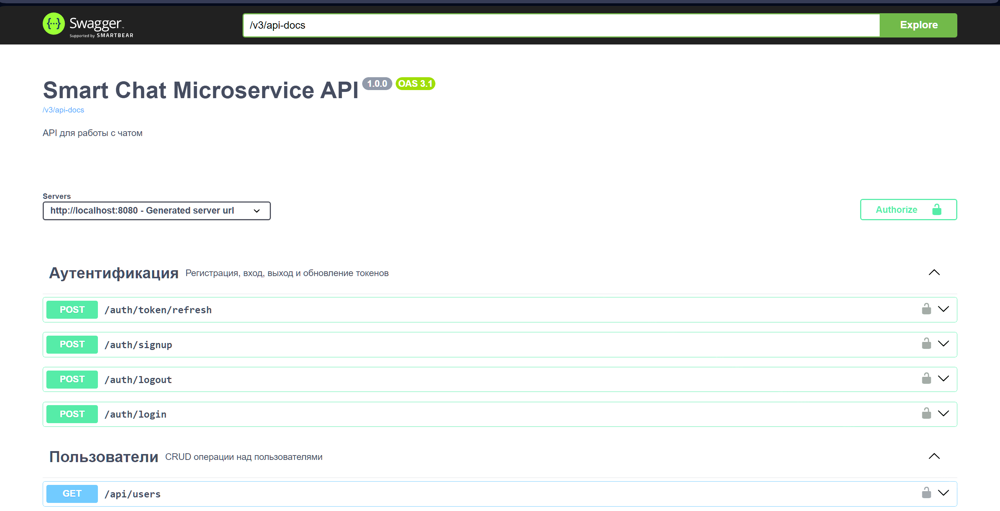

# Smart Chat Microservice

Полнофункциональный микросервис для общения в реальном времени, разработанный на Spring Boot с использованием Kafka,
Redis и PostgreSQL.

## Особенности проекта

1. **Аутентификация и авторизация (Spring Security + JWT)**
    - Генерация Access и Refresh токенов
    - Хэширование паролей с BCrypt
    - Черный список (blacklist) JWT в Redis для logout

2. **Микросервисная архитектура**
    - Producer -> Kafka -> Consumer
    - Асинхронная обработка сообщений с ThreadPool

3. **Хранение данных**
    - **PostgreSQL** для персистентности чатов, пользователей и истории сообщений
    - **Redis** для кеширования последних N сообщений и хранения токенов

4. **REST API**
    - CRUD для чатов и пользователей
    - Отправка сообщений Kafka Producer
    - Чтение истории, поиск по тексту, статистика по чатам

5. **Документация и мониторинг**
    - **Swagger UI**: интерактивная документация OpenAPI
    - **Actuator**: health, metrics, httpexchanges, info

6. **Инфраструктура**
    - **Docker Compose**: PostgreSQL, Redis, Zookeeper, Kafka, приложение

## Быстрый старт

```bash
# Клонирование репозитория
git clone https://github.com/AlexanderPolozhnov/smart-chat-microservice.git
cd smart-chat-microservice

# Сборка без тестов
mvn clean package -DskipTests

# Запуск инфраструктуры
docker-compose up -d

# Запуск приложения
docker-compose exec app java -jar /app/app.jar
```

После запуска доступно:

* Swagger UI: [http://localhost:8080/swagger-ui/index.html](http://localhost:8080/swagger-ui/index.html)
* Actuator health: [http://localhost:8080/actuator/health](http://localhost:8080/actuator/health)

## Структура проекта

```
src/
   main/
      java/com/alexander/smartchat
         config/              # Kafka, Swagger, Security, Actuator
         controller/          # REST endpoints (@Tag annotations)
         dto/                 # Data Transfer Objects
         entity/              # JPA Entities
         exception/           # Custom and global exception
         filter/              # JwtFilter
         mapper/              # MapStruct interfaces
         repository/          # Spring Data JPA
         service/             # Business logic
            jwt/              # JwtAuthEntryPoint, JwtProvider
            kafka/            # Producer & Consumer
            redis/            # RedisCacheService
         util/                # JwtParseUtil, others
   resources/
      db/changelog/
      application.yml
      application-local.yml (.gitignore)
      application-docker.yml
   test/                      # Unit & Integration tests
docker-compose.yml
Dockerfile
README.md
```

## Конфигурация

### application.yml

```yaml
spring:
  profiles:
    default: local

  datasource:
    driver-class-name: org.postgresql.Driver
    url: jdbc:postgresql://localhost:5432/smart_chat_db
    username: postgres
    password: ${DB_PASSWORD}

  jpa:
    hibernate:
      ddl-auto: update
    show-sql: true
    properties:
      hibernate:
        format_sql: true
      jdbc:
        batch_size: 50

  data:
    redis:
      host: localhost
      port: 6379

  liquibase:
    change-log: classpath:db/changelog/db.changelog-master.yml
    enabled: true

  security:
    user:
      name: none

  graphql:
    cors:
      allowed-origins: "*"

  kafka:
    producer:
      key-serializer: org.apache.kafka.common.serialization.StringSerializer
      value-serializer: org.springframework.kafka.support.serializer.JsonSerializer
    consumer:
      group-id: smartchat-group
      key-deserializer: org.apache.kafka.common.serialization.StringDeserializer
      value-deserializer: org.springframework.kafka.support.serializer.JsonDeserializer
      properties:
        spring.json.trusted.packages: com.alexander.smartchat.dto

kafka:
  topic:
    name: chat-messages

chat:
  message-cache-ttl: PT24H

jwt:
  secret:
    access: <base64-access-secret>
    refresh: <base64-refresh-secret>
  access-validity-minutes: 15
  refresh-validity-days: 5

management:
  endpoints:
    web:
      exposure:
        include: health,info,metrics,httpexchanges
  endpoint:
    health:
      show-details: always
```

## Порты сервисов

| Сервис        | Порт |
|---------------|------|
| PostgreSQL    | 5432 |
| Redis         | 6379 |
| Zookeeper     | 2181 |
| Kafka Broker  | 9092 |
| SmartChat App | 8080 |

## Тестирование

```bash
# Unit + WebMvc тесты
mvn test

# Отчёт по покрытию
mvn jacoco:report
```

## Демонстрация



1. **Регистрация**: POST /auth/signup
2. **Логин**:      POST /auth/login
3. **Создать чат**: POST /api/chats
4. **Отправить сообщение**: POST /api/messages
5. **История**:    GET /api/messages
